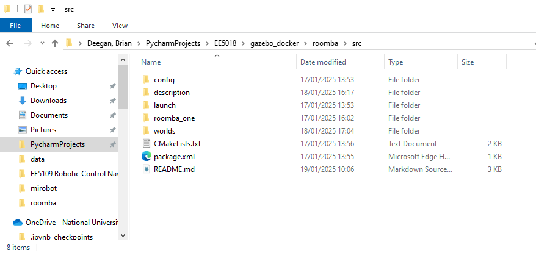

# Simulating a Roomba-Style Robot with ROS2 and Gazebo

## Overview

This lab assignment aims to simulate a Roomba-style robot using ROS2 and Gazebo. You will create a simple robot model, configure it with sensors, and use ROS2 to control its movement within a simulated environment.

## Objectives

- Understand how to model a robot using URDF and XACRO files.
- Set up a simulation environment in Gazebo.
- Implement basic navigation and obstacle avoidance using ROS2.

## Prerequisites

- Basic understanding of ROS2.
- Familiarity with Gazebo simulation.
- Installed ROS2 and Gazebo.
- Docker Container and XServer.

## Setup
In this lab, we will use a docker container and Xserver. We will also use volumes to share data between our docker container and host OS.
- Open Visual Studio Code
- Create a folder called `lab_one`in your workspace, and clone the lab_one github into this folder


## Getting Started

### Repository Structure

```
/home/ros2_ws/src/
│
├── README.md
├── config
│   └── empty.yaml
├── CMakeLists.txt
├── package.xml
├── launch/
│   └── rsp.launch.py
├── description/
│   ├── robot_base.xacro
│   └── robot.urdf.xacro
└── worlds/
    └── roomba.world
```

### Instructions

1. **Set up Your Environment**

   - Make sure you have the necessary ROS2 and Gazebo setup on your system. Follow the ROS2 [installation guide](https://docs.ros.org/en/rolling/Installation.html) for your operating system.

2. **Create a source directory (src)**

   - Create a source directory (src) in your ros2_ws:

     ```bash
     cd home/ros2_ws
     mkdir src
     ```
    - Copy the contents of the template into the src folder
    


3. **Create a ROS2 Package**   
    - Create a new ROS2 package (if not already done). You may name it `roomba_one`:  
     ```bash
     ros2 pkg create --build-type ament_cmake roomba_one
     cd roomba_simulation
     ```
    - If successful, you should see a folder structure like this:


4. **Define the Robot Model**

   - Create a file called `robot_core.xacro`in the `Description` directory. This file will define the shape and characteristics of the roomba robot. The parameters of the robot are:
        - the radius of the roomba chassis shall be 0.18 m 
        - the height of the roomba chassis shall be 0.09 m
        - the mass of the roomba chassis shall be 3.5 kg 
        - there shall be two cylindrical wheels and one spherical castor wheel
        - the radius of the cylindrical wheels shall be 0.033 m
        - the thickness of the cylindrical wheels shall be 0.025 cm
        - the mass of the cylindrical wheels shall be 0.05 kg
        - the radius of the castor wheel shall be 0.03 m
        - the mass of the castor wheel shall be 0.05 kg
        - the chassis colour shall be red
        - the cylindrical wheel colour shall be blue
        - the castor wheel colour shall be white

    - As part of the exercise, you will be required to define the position of the cylinder and castor wheel. Below is a photo of a real zoomba. Use this as a reference.
        - Hint: refer to robot_core.xacro in https://github.com/joshnewans/articubot_one/tree/main/description as a guide


5. **Create the Simulation Environment**

   - If not done already, in the `worlds` directory, create a basic Gazebo world file (`roomba_world.world`) to simulate an indoor environment. We will populate this world with more interesting stuff in later labs

6. **Build your package**
    ``` bash
    cd /home/ros2_ws
       colcon build --symlink-install
       # source your package
       source install/setup.bash
    ``` 

7. **Launch the Simulation**

   - Use the launch file `roomba_one.launch.py` to spawn the robot in Gazebo.

   ```bash
   cd /home/ros2_ws/
   ros2 launch roomba_one roomba_one.launch.py world:=src/lab_one/worlds/roomba_world.world
   ```
   - If everything goes according to plan, you should see something like this:
   

### Next steps
Once we successfully visualize our robot in gazebo, we will use ros2_control to move our robot in its environment

---

### Additional Resources

- [ROS2 Documentation](https://docs.ros.org/en/rolling/Releases.html)
- [Gazebo Documentation](http://gazebosim.org/tutorials)
- [Ros2 Tutorials - Articulated Robotics](https://articulatedrobotics.xyz/tutorials/)

